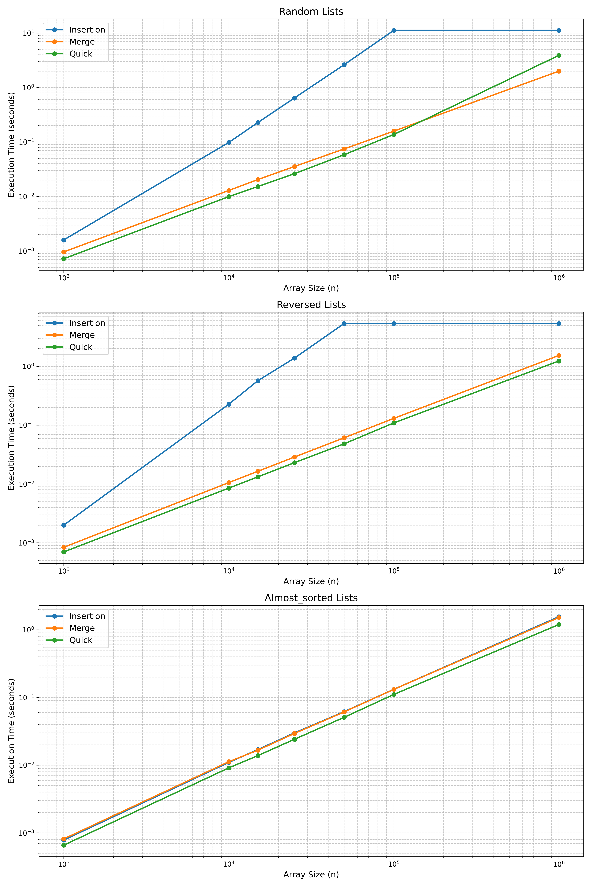

Vi har implemeteret pseudo kode for de tre sortering, algorithmer i python. 
Spændende ting er at vi har randomizeret partition i quicksort, samt at vi har implementeret binary search i insertion sort. 

Note: Vi har tilføjet ekstra kode for at output test resultaterne i en tabel. 

## Random
Ud for test resultaterne, kan vi konkludere insertion er klart langsomt, hvilket giver mening da den har en værste køretid på O(n^2).

Quicksort og mergesort er meget tæt, dog er merge-sort hurtigere ved 1000000 elementer.

## reversed
Insertion rammer også worst case køretid. 
Her er det spændende er at her er quicksort altid hurtigere. 

## Almost sorted
Her er insertion sort hurtigere, da den har en bedste køretid på O(n). Hermed matcher den Mergesort. 

Quicksort hurtigst. 

